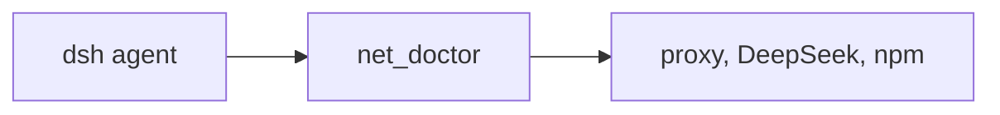

# dsh-wsl-net
> **Install set:** part of [dsh-wsl-kit](https://github.com/173787247/dsh-wsl-kit). Prefer `KIT_SET=daily` | `llm` | `github` | `full` (see kit README). Fault tree: [TROUBLESHOOTING.md](https://github.com/173787247/dsh-wsl-kit/blob/master/docs/TROUBLESHOOTING.md).


DeepSeek Harness **tool** plugin: `net_doctor` diagnoses why HTTPS works in the Windows browser but fails from the WSL agent—and returns **copy-paste fix scripts**.

Pairs with [dsh-wsl-env](https://github.com/173787247/dsh-wsl-env). Part of **[dsh-wsl-kit](https://github.com/173787247/dsh-wsl-kit)**.

[中文说明 → README.zh.md](./README.zh.md)

## Where it sits

Diagnoses why the Windows browser can reach HTTPS while the WSL agent cannot. In-process page fetch is dsh-wsl-fetch, not this plugin.



Suite diagram and version snapshot: [dsh-wsl-kit](https://github.com/173787247/dsh-wsl-kit#how-the-pieces-fit). This plugin is **0.5.2** (daily; also in llm). Do not copy that matrix into this README.


---
## Compatibility

| Field | Value |
|-------|-------|
| **Plugin** | `dsh-wsl-net` **0.5.2** |
| **Minimum dsh** | ≥ **0.1.2** (web UI one-shot `?token=` on Windows relay `:3081`) |
| **Latest verified** | See [dsh-wsl-kit Compatibility](https://github.com/173787247/dsh-wsl-kit#compatibility-2026-09) (currently **`0.1.7-alpha.2`**) — single source of truth for the suite |
| **Kit set** | `daily` (also in `github` / `full`; fetch+net also in `llm`) |
| **Cloud Flash** | Use model id **`deepseek-flash`** (V4.1 Flash) in `~/.dsh/settings.yaml` / `llm-deepseek` — not configured by this plugin |
| **Agent Teams** | Upstream experimental; not required here |

Suite floor versions: kit [`check-plugin-versions.sh`](https://github.com/173787247/dsh-wsl-kit/blob/master/scripts/check-plugin-versions.sh). Fault tree: [TROUBLESHOOTING.md](https://github.com/173787247/dsh-wsl-kit/blob/master/docs/TROUBLESHOOTING.md).

**Scope:** diagnoses proxy / Node 24 / DeepSeek+npm reachability for the agent process and child shells. It does **not** fix in-process `web_fetch` (use [dsh-wsl-fetch](https://github.com/173787247/dsh-wsl-fetch)). Prefer kit `restart-dsh-web.sh` so the **dsh main process** gets `NODE_USE_ENV_PROXY=1` and loopback-only `NO_PROXY`.

## Why

Clash / V2Ray often runs on Windows with `HTTP_PROXY=http://127.0.0.1:…`. Node **24** `fetch` ignores proxy env vars unless `NODE_USE_ENV_PROXY=1`. The browser can look fine while the agent cannot reach DeepSeek or npm.

## What it does

- Reports `HTTP_PROXY` / `HTTPS_PROXY` / `ALL_PROXY` / `NO_PROXY` (userinfo redacted), `NODE_USE_ENV_PROXY`, optional npm registry
- Also inspects the **running `dsh web` process** env (`dshWeb`) so you can tell tool-process vs host-process proxy flags apart
- TCP-probes the configured proxy port (`proxyListen`)
- Probes DeepSeek API and the npm registry (HTTP status &lt; 500 counts as reachable, including 401)
- Returns `advice` plus `fix.steps` / `fix.scripts` (reuses current proxy when set; otherwise a `127.0.0.1:7890` template you must edit)
- Optionally injects `NODE_USE_ENV_PROXY=1` and lowercase `http_proxy` aliases into bash/npm **child** processes (`injectChildProxy`)

Does **not** print API keys, change Clash ports, or invent a proxy URL when none is configured.

**Related:** in-process `web_fetch` failures while API works → [dsh-wsl-fetch](https://github.com/173787247/dsh-wsl-fetch). Inherited Clash `NO_PROXY=10.*` breaking DeepSeek → kit `restart-dsh-web.sh` (loopback-only `NO_PROXY`).

## Install

```sh
dsh plugin --profile web add github:173787247/dsh-wsl-net
```

Restart `dsh web`. In a new session, Tools should list `net_doctor`. Example ask: “Check whether DeepSeek API and npm are reachable.”

Child injection check:

```sh
node -e "console.log(process.env.NODE_USE_ENV_PROXY, process.env.http_proxy || process.env.HTTP_PROXY)"
```

Expect `1` and your proxy URL when a child bash/npm is wrapped.

## Tool parameters

| Arg | Values | Meaning |
|-----|--------|---------|
| `target` | `all` (default), `env`, `deepseek`, `npm` | What to check |

## Config

```yaml
- id: dsh-wsl-net
  name: dsh-wsl-net
  config:
    timeoutMs: 20000
    probeTimeoutMs: 5000
    injectChildProxy: true
```

| Key | Default | Meaning |
|-----|---------|---------|
| `timeoutMs` | `20000` | Tool timeout |
| `probeTimeoutMs` | `5000` | Per-probe timeout |
| `injectChildProxy` | `true` | Wrap `subprocess.spawn` / `spawnTerminal` |

## Changelog (short)

- **0.3.0** — `fix` copy-paste scripts
- **0.2.x** — child proxy injection; redact proxy userinfo; `ALL_PROXY`

## Test

```sh
npm test
```

## License

MIT
