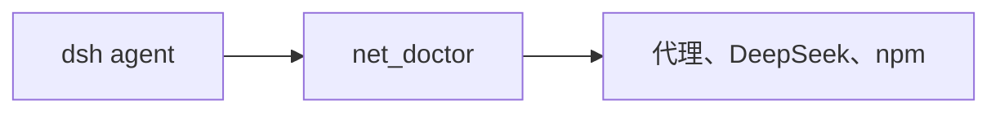

# dsh-wsl-net
> **套件安装：** 见 [dsh-wsl-kit](https://github.com/173787247/dsh-wsl-kit)。推荐 `KIT_SET=daily` | `llm` | `github` | `full`。故障树：[TROUBLESHOOTING.zh.md](https://github.com/173787247/dsh-wsl-kit/blob/master/docs/TROUBLESHOOTING.zh.md)。


DeepSeek Harness **工具**插件：`net_doctor` 诊断「Windows 浏览器 HTTPS 正常、WSL 里 Agent 却失败」的原因，并返回**可复制粘贴的修复脚本**。

与 [dsh-wsl-env](https://github.com/173787247/dsh-wsl-env) 搭配。属于 **[dsh-wsl-kit](https://github.com/173787247/dsh-wsl-kit)**。

[English → README.md](./README.md)

## 在套件里的位置

诊断为什么 Windows 浏览器能上 HTTPS，WSL 里的 agent 却不行。进程内抓页是 dsh-wsl-fetch，不是本插件。



整套关系图和版本快照：[dsh-wsl-kit 中文说明](https://github.com/173787247/dsh-wsl-kit/blob/master/README.zh.md)。本插件是 **0.5.2**（daily，也在 llm）。不要把那份总表抄进本 README。


---
## 兼容性

| 项 | 值 |
|----|----|
| **插件** | `dsh-wsl-net` **0.5.2** |
| **最低 dsh** | ≥ **0.1.2**（Windows 中继 `:3081` 一次性 `?token=`） |
| **最新验证** | 以 [dsh-wsl-kit 兼容性](https://github.com/173787247/dsh-wsl-kit#compatibility-2026-09) 为准（当前 **`0.1.7-alpha.2`**）— 套件唯一真源 |
| **套件档位** | `daily`（亦含于 `github` / `full`；fetch+net 亦在 `llm`） |
| **云端 Flash** | settings / `llm-deepseek` 使用 **`deepseek-flash`**（V4.1 Flash）；本插件不配置模型 id |
| **Agent Teams** | 上游实验包；本插件不依赖 |

套件版本地板：[`check-plugin-versions.sh`](https://github.com/173787247/dsh-wsl-kit/blob/master/scripts/check-plugin-versions.sh)。故障树：[TROUBLESHOOTING.zh.md](https://github.com/173787247/dsh-wsl-kit/blob/master/docs/TROUBLESHOOTING.zh.md)。

**范围：** 诊断代理 / Node 24 / DeepSeek+npm 可达性（含 dsh 主进程与子 shell）。**不**修复进程内 `web_fetch`（用 [dsh-wsl-fetch](https://github.com/173787247/dsh-wsl-fetch)）。请用套件 `restart-dsh-web.sh`，让 **dsh 主进程**带上 `NODE_USE_ENV_PROXY=1` 与仅回环的 `NO_PROXY`。

## 为什么需要

Clash / V2Ray 常跑在 Windows 上，环境变量是 `HTTP_PROXY=http://127.0.0.1:…`。Node **24** 的 `fetch` 默认不读代理环境变量，除非设置 `NODE_USE_ENV_PROXY=1`。浏览器看起来正常，Agent 却打不通 DeepSeek 或 npm。

## 功能

- 报告 `HTTP_PROXY` / `HTTPS_PROXY` / `ALL_PROXY` / `NO_PROXY`（隐藏 userinfo）、`NODE_USE_ENV_PROXY`、可选 npm registry
- 也会检查**正在运行的 `dsh web` 进程**环境（`dshWeb`），区分「工具进程」与「主进程」代理标志
- **TCP 探测代理端口**（`proxyListen`）：端口没开会直接指出
- 探测 DeepSeek API 与 npm / ModelScope（HTTP 状态码 &lt; 500 视为可达，含 401）
- 针对 DeepSeek Search `TypeError: fetch failed` 给出 `NODE_USE_ENV_PROXY=1` + `restart-dsh-web.sh` 修复脚本；**进程内 `web_fetch` 仍需 [dsh-wsl-fetch](https://github.com/173787247/dsh-wsl-fetch)**
- 可选：给 bash/npm **子进程**注入 `NODE_USE_ENV_PROXY=1` 与小写 `http_proxy` 别名（`injectChildProxy`）

**不会**打印 API Key、不会改 Clash 端口、也不会在未配置时代造一个代理 URL。主进程请用套件 `restart-dsh-web.sh`（`NO_PROXY` 仅回环）。

## 安装

```sh
dsh plugin --profile web add github:173787247/dsh-wsl-net
```

重启 `dsh web`。新会话的 Tools 应列出 `net_doctor`。示例：「检查 DeepSeek API 和 npm 通不通。」

检查子进程注入：

```sh
node -e "console.log(process.env.NODE_USE_ENV_PROXY, process.env.http_proxy || process.env.HTTP_PROXY)"
```

被包装的 bash/npm 子进程应看到 `1` 和你的代理 URL。

## 工具参数

| 参数 | 取值 | 含义 |
|------|------|------|
| `target` | `all`（默认）、`env`、`deepseek`、`npm` | 检查范围 |

## 配置

```yaml
- id: dsh-wsl-net
  name: dsh-wsl-net
  config:
    timeoutMs: 20000
    probeTimeoutMs: 5000
    injectChildProxy: true
```

| 键 | 默认 | 含义 |
|----|------|------|
| `timeoutMs` | `20000` | 工具超时 |
| `probeTimeoutMs` | `5000` | 单次探测超时 |
| `injectChildProxy` | `true` | 是否包装 `subprocess.spawn` / `spawnTerminal` |

## 更新摘要

- **0.3.0** — `fix` 可复制脚本
- **0.2.x** — 子进程代理注入；隐藏代理 userinfo；`ALL_PROXY`

## 测试

```sh
npm test
```

## 许可

MIT
